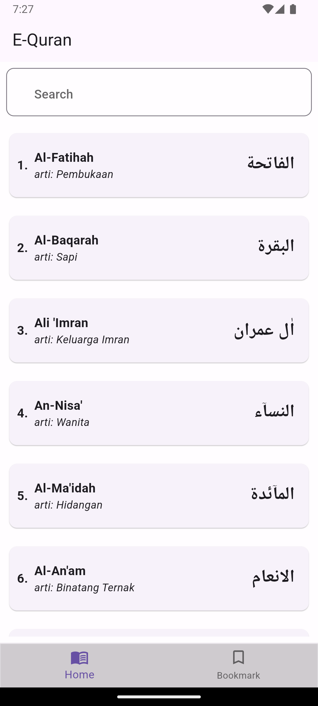
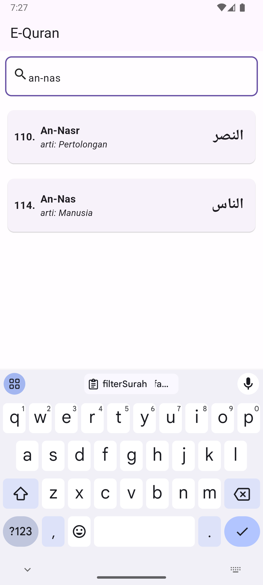
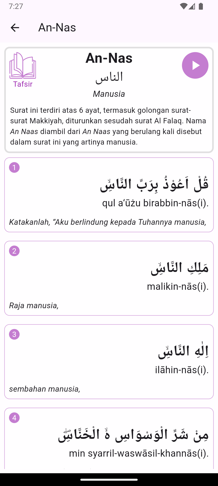
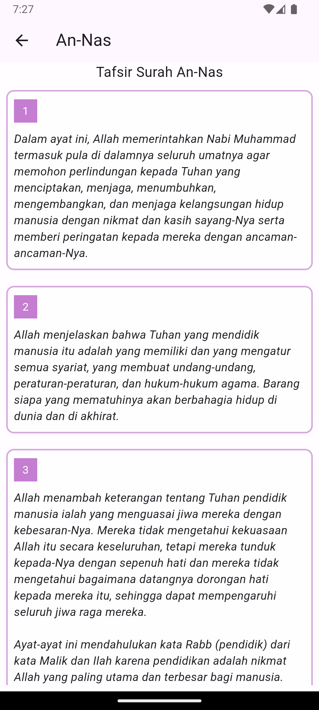
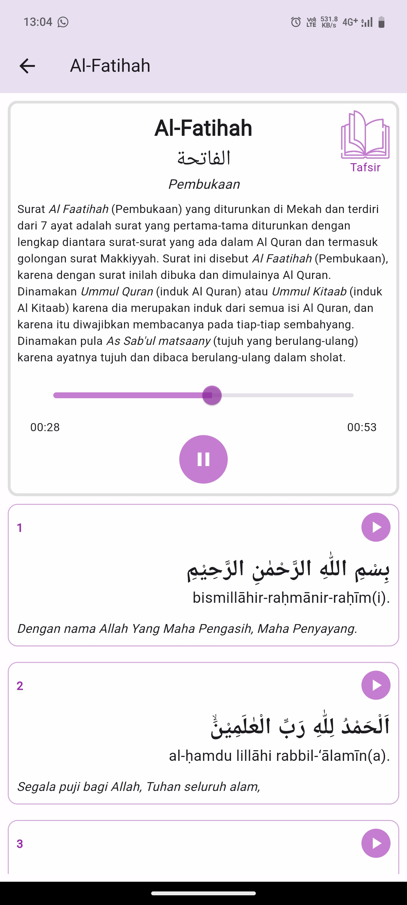
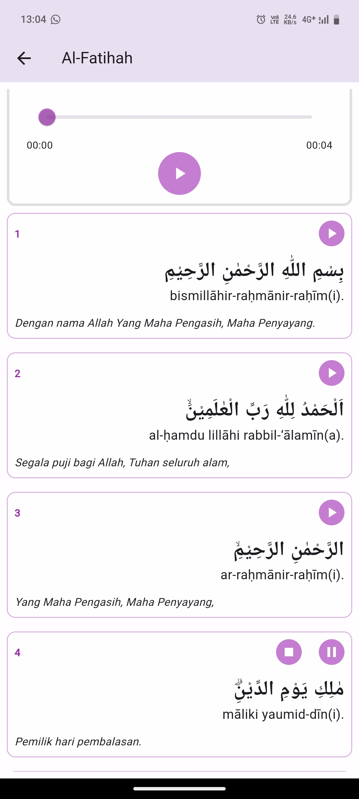

# my_equran

## Mobile Al-Quran

This project is a Mobile Application for Reading Al-quran

## Getting Started
-   Flutter Version 3.22.0
-   Dart Version 3.4.0

### Running Project
-   flutter clean
-   flutter pub get
-   dart run build_runner build
-   flutter run --flavor=dev

### Download File .Apk
- Download Apk <a href="app-prod-release.apk">app-prod-release.apk</a>

## Stack
- Clean Architecture
- State Management: FLutter Bloc
- Rest Api: Dio
- Local Database: ObjectBox
- Unit Testing: Mockito

## Feature
- Biometric Authentication
- AudioPlayers
- [ ] Caching

## Preview

